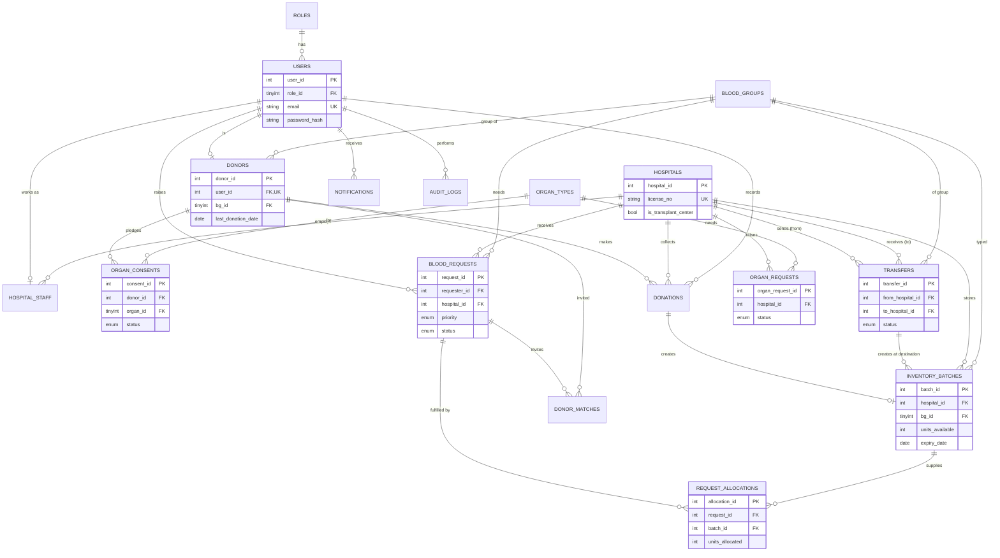

# ER Diagram (Mermaid – renders in GitHub, VS Code "Markdown Preview Mermaid", or https://mermaid.live)

```mermaid
erDiagram
    ROLES ||--o{ USERS : "has"
    USERS ||--o| DONORS : "is"
    USERS ||--o| HOSPITAL_STAFF : "works as"
    HOSPITALS ||--o{ HOSPITAL_STAFF : "employs"
    BLOOD_GROUPS ||--o{ DONORS : "group of"
    DONORS ||--o{ ORGAN_CONSENTS : "pledges"
    ORGAN_TYPES ||--o{ ORGAN_CONSENTS : "for"
    DONORS ||--o{ DONATIONS : "makes"
    HOSPITALS ||--o{ DONATIONS : "collects"
    USERS ||--o{ DONATIONS : "records"
    DONATIONS ||--o| INVENTORY_BATCHES : "creates"
    TRANSFERS ||--o{ INVENTORY_BATCHES : "creates at destination"
    HOSPITALS ||--o{ INVENTORY_BATCHES : "stores"
    BLOOD_GROUPS ||--o{ INVENTORY_BATCHES : "typed"
    USERS ||--o{ BLOOD_REQUESTS : "raises"
    HOSPITALS ||--o{ BLOOD_REQUESTS : "receives"
    BLOOD_GROUPS ||--o{ BLOOD_REQUESTS : "needs"
    BLOOD_REQUESTS ||--o{ REQUEST_ALLOCATIONS : "fulfilled by"
    INVENTORY_BATCHES ||--o{ REQUEST_ALLOCATIONS : "supplies"
    BLOOD_REQUESTS ||--o{ DONOR_MATCHES : "invites"
    DONORS ||--o{ DONOR_MATCHES : "invited"
    HOSPITALS ||--o{ TRANSFERS : "sends (from)"
    HOSPITALS ||--o{ TRANSFERS : "receives (to)"
    BLOOD_GROUPS ||--o{ TRANSFERS : "of group"
    HOSPITALS ||--o{ ORGAN_REQUESTS : "raises"
    ORGAN_TYPES ||--o{ ORGAN_REQUESTS : "needs"
    USERS ||--o{ NOTIFICATIONS : "receives"
    USERS ||--o{ AUDIT_LOGS : "performs"

    USERS { int user_id PK
            tinyint role_id FK
            string email UK
            string password_hash }
    DONORS { int donor_id PK
             int user_id FK, UK
             tinyint bg_id FK
             date last_donation_date }
    HOSPITALS { int hospital_id PK
                string license_no UK
                bool is_transplant_center }
    INVENTORY_BATCHES { int batch_id PK
                        int hospital_id FK
                        tinyint bg_id FK
                        int units_available
                        date expiry_date }
    BLOOD_REQUESTS { int request_id PK
                     int requester_id FK
                     int hospital_id FK
                     enum priority
                     enum status }
    REQUEST_ALLOCATIONS { int allocation_id PK
                          int request_id FK
                          int batch_id FK
                          int units_allocated }
    TRANSFERS { int transfer_id PK
                int from_hospital_id FK
                int to_hospital_id FK
                enum status }
    ORGAN_CONSENTS { int consent_id PK
                     int donor_id FK
                     tinyint organ_id FK
                     enum status }
    ORGAN_REQUESTS { int organ_request_id PK
                     int hospital_id FK
                     enum status }
```
